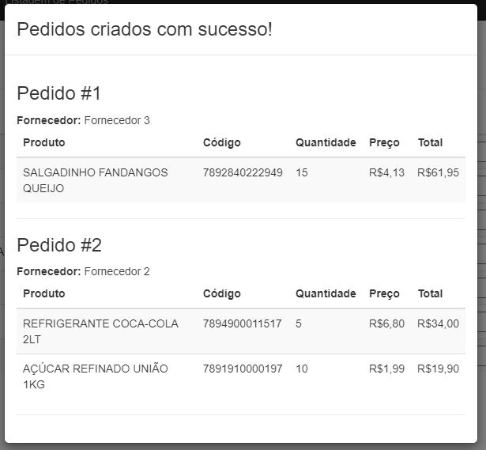

## Requisitos Gerais para execução do projeto em ambiente local usando Docker
- Docker/WSL2 instalado e configurado no ambiente Windows. Sugestão(https://github.com/codeedu/wsl2-docker-quickstart)

## Executar o Projeto API desafio de pedidos em ambiente local usando Docker
- Opção 1: Abrir um terminal na pasta raiz do projeto e executar o comando "sh executar-projeto.sh"
- Opção 2: Abrir pasta pedidos-api e executar o arquivo "sh executar-projeto.sh". 

## Links para uso da aplicação no ambiente local
- Dados de login para autenticação básica: user: **admin** e senha: **admin**
- Criar novos pedidos: http://localhost/#!/pedidos/novo
- Listar Pedidos: http://localhost/#!/pedidos
- Swagger API Pedidos: http://localhost/pedidos-api/swagger-ui.html
- Swagger API Fornecedores: http://localhost:81/fornecedores-api/swagger-ui.html

## Regras de negócio do desafio:

A proposta deste desafio é conhecer suas habilidades de resolver problemas de negócio por meio de programação.
Estamos enviando para você um arquivo zip contendo um projeto de uma aplicação Java Web (Spring Boot, Hibernate e AngularJs) com o Frontend já desenvolvido.

Seu desafio será implementar o Backend e integrar com o Frontend.

## O problema

Você deve desenvolver um sistema para realizar **pedidos** a partir de uma lista de **produtos**, conforme a imagem:


Os produtos **já estão cadastrados** e possuem 2 atributos: GTIN (código de barra) e nome.

Quando o usuário digitar a quantidade de cada produto e clicar no botão Enviar, o sistema deverá chamar a API externa de Fornecedores informando o GTIN de cada produto. O retorno da API será uma lista de **fornecedores** e dentro de cada fornecedor uma lista de **preços** de acordo com a **quantidade mínima** para compra. Não é obrigatório informar a quantidade para todos os produtos.

Veja um exemplo do retorno da API externa para o GTIN 7894900011517:
```json
[
    {
        "nome": "Fornecedor 1",
        "cnpj": "56.918.868/0001-20",
        "precos": [
            {
                "preco": 6.89,
                "quantidade_minima": 1
            },
            {
                "preco": 5.89,
                "quantidade_minima": 10
            }
        ]
    },
    {
        "nome": "Fornecedor 2"
        "cnpj": "37.563.823/0001-35",
        "precos": [
            {
                "preco": 6.8,
                "quantidade_minima": 1
            },
            {
                "preco": 6,
                "quantidade_minima": 10
            }
        ],
    }
]
```

O sistema deve selecionar o melhor fornecedor para compra de cada produto considerando o menor preço que atenda a quantidade mínima de compra. Em seguida, deverá agrupar os produtos de um mesmo fornecedor e criar um pedido para cada um. O resultado será algo semelhante a imagem:



Caso nenhum fornecedor atenda a quantidade mínima de qualquer um dos produtos, o sistema deverá retornar uma mensagem informando o usuário e não deve criar nenhum pedido:


O pedido deve ter um fornecedor e uma lista dos itens comprados. Caso o fornecedor retornado pela API ainda não esteja cadastrado, o sistema deverá incluí-lo para poder vincular com o pedido.

O sistema também deverá possuir uma rota para listar todos os pedidos criados até o momento.
 devidos ajuste de acordo com sua necessidade


## Links para uso da aplicação no ambiente AWS (MÁQUINA INATIVA NO MOMENTO)
- Dados de login para autenticação básica: user: **admin** e senha: **admin**
- Criar novos pedidos: http://ec2-44-205-6-211.compute-1.amazonaws.com/#!/pedidos/novo
- Listar Pedidos: http://ec2-44-205-6-211.compute-1.amazonaws.com/#!/pedidos
- Swagger: http://ec2-44-205-6-211.compute-1.amazonaws.com/pedidos-api/swagger-ui.html

## Instruções de Deploy na AWS
- Utilize como base a documentação do arquivo README.md presente no diretório backend no seguinte projeto: https://github.com/wesleyeduardodev/crud-angular-spring-deploy-aws-docker-postgres-terraform/tree/master/backend
- Faça os devidos ajustes de acordo com sua necessidade
